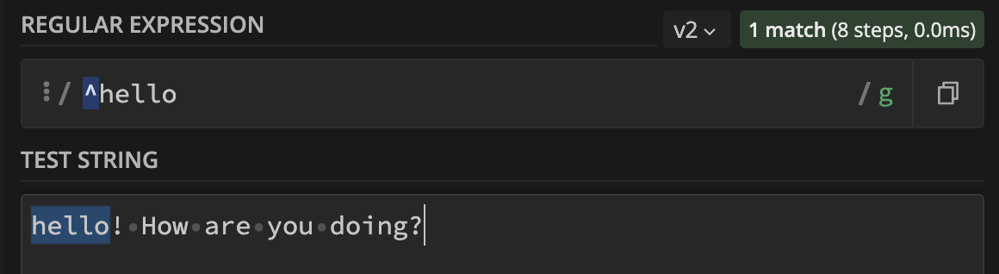
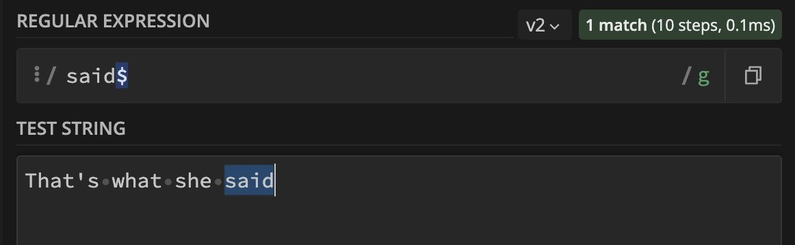
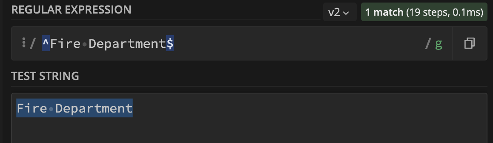
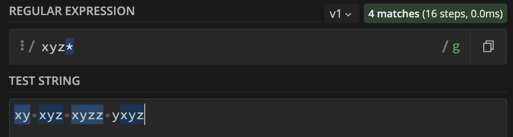
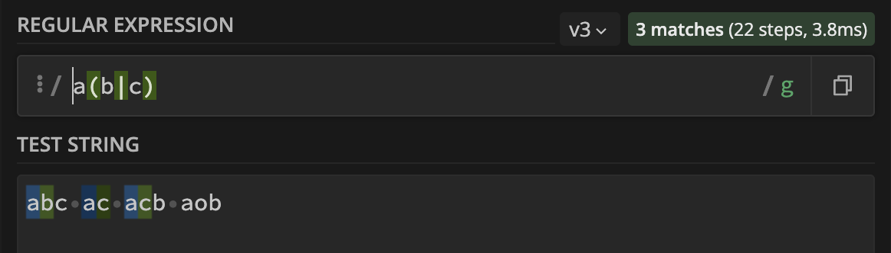
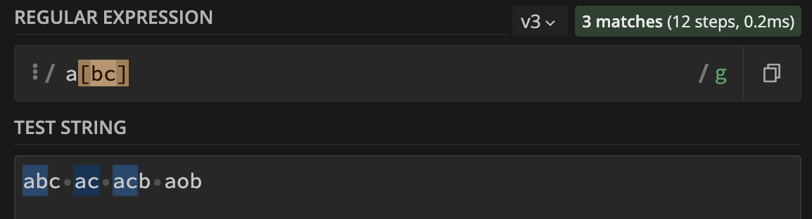

# RegEx

Regular Expressions, also known as RegEx or RegExp, are used to extract specific information from text. They are often used to locate or validate a specific string within a larger body of text. Most programming languages support the use of Regular Expressions. This document provides a quick reference to some common RegEx patterns and their uses.

## Summary

Briefly summarize the regex you will be describing and what you will explain. Include a code snippet of the regex. Replace this text with your summary.

## Table of Contents

- [Anchors](#anchors)
- [Quantifiers](#quantifiers)
- [OR Operator](#or-operator)
- [Character Classes](#character-classes)
- [Flags](#flags)
- [Grouping and Capturing](#grouping-and-capturing)
- [Bracket Expressions](#bracket-expressions)
- [Greedy and Lazy Match](#greedy-and-lazy-match)
- [Boundaries](#boundaries)
- [Back-references](#back-references)
- [Look-ahead and Look-behind](#look-ahead-and-look-behind)

## Regex Components

### Anchors
Anchors in RegEx are not used to match any character, but rather to match a specific position in the text. This position may be before or after certain characters. Anchors allow for more precise matching and manipulation of the text.

* The ```^``` anchor in RegEx matches the position at the beginning of the text. This allows the RegEx pattern to only match strings that appear at the start of the text, rather than anywhere within the text.

* The ```$``` anchor in RegEx matches the position at the end of the text. This allows the RegEx pattern to only match strings that appear at the end of the text, rather than anywhere within the text."

Examples:

**```^hello```** - matches any string that **starts with hello**.


**```said$```** - matches a string that **ends with said**


**```^Fire Department$```** - **exact string match** (starts and ends with Fire Department)


### Quantifiers

Quantifiers in RegEx are used to specify the number of times a character or group must appear in the input text for the RegEx pattern to match. For example, a quantifier can be used to specify that a certain character must appear exactly three times in a row for the RegEx pattern to match the input text.

Examples:

**```xyz*```** - matches a string that has **xy followed by zero or more z**.


**```xyz+```** - matches a string that has **xy followed by one or more z**.

**```xyz?```** - matches a string that has **xy followed by zero or one z**.

**```xyz{2}```** - matches a string that has **xy followed by 2 z**.

**```xyz{2,}```** - matches a string that has **xy followed by 2 or more z**.

**```xyz{2,5}```** - matches a string that has **xy followed by 2 up to 5 z**.

**```x(yz)*```** - matches a string that has **x followed by zero or more copies of the sequence yz**.

### OR Operator
The Or operator, represented by ```|``` or ```[]``` in RegEx, is used to specify two or more alternative patterns. The RegEx will match the input text if it matches any of the specified alternative patterns. For example, the pattern cat|dog will match the input cat or the input dog, but not the input mouse.

Examples:

The RegEx pattern ```a(b|c)``` will match any string that has the character x followed by either y or z. For example, the pattern would match the input xyz, but not the input abc. This pattern uses the Or operator to specify that the character x must be followed by either y or z for the RegEx to match the input text.



The RegEx pattern ```a[bc]``` will match any string that has the character x followed by either y or z. This pattern uses a character class (enclosed in square brackets) to specify the list of allowed characters that may follow x. For example, the pattern would match the input xyz, but not the input abc. The character class allows the RegEx to match any character within the specified list that follows x.


### Character Classes

### Flags

### Grouping and Capturing

### Bracket Expressions

### Greedy and Lazy Match

### Boundaries

### Back-references

### Look-ahead and Look-behind

## Author

A short section about the author with a link to the author's GitHub profile (replace with your information and a link to your profile)
