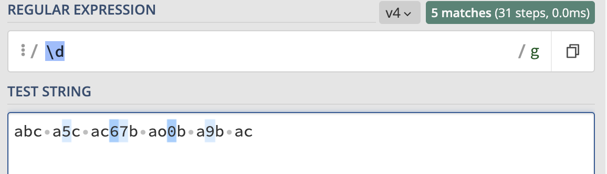
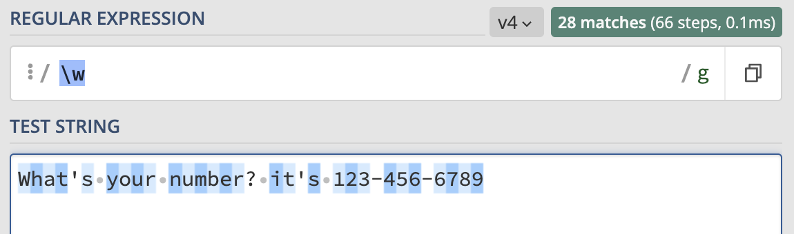
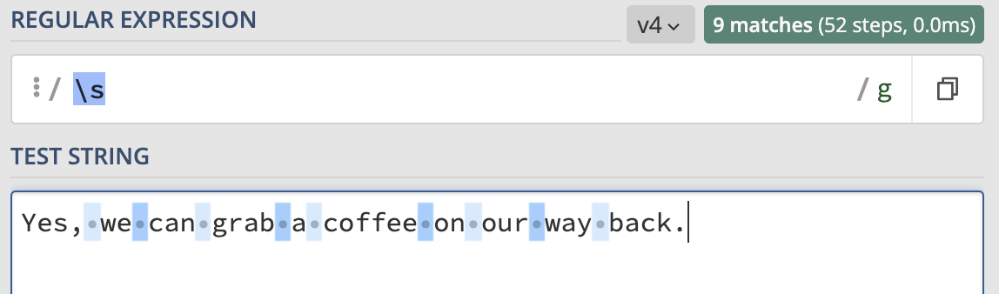

# RegEx

Regular Expressions, also known as RegEx or RegExp, are used to extract specific information from text. They are often used to locate or validate a specific string within a larger body of text. Most programming languages support the use of Regular Expressions. This document provides a quick reference to some common RegEx patterns and their uses.

## Summary

To match an email address using a regular expression, you can use the following pattern:

```[a-z0-9._%+-]+@[a-z0-9.-]+\.[a-z]{2,4}```

This pattern matches a string that contains a sequence of one or more characters that are either lowercase letters, numbers, or the special characters ```.```, ```_```, ```%```, ```+```, or ```-```, followed by an ```@``` symbol, followed by another sequence of one or more lowercase letters, numbers, or the special character ```.```, followed by a ```.``` symbol and two to four lowercase letters. This pattern should match most common email addresses, but it may not match all possible valid email addresses.

## Table of Contents

- [Anchors](#anchors)
- [Quantifiers](#quantifiers)
- [OR Operator](#or-operator)
- [Character Classes](#character-classes)
- [Flags](#flags)
- [Grouping and Capturing](#grouping-and-capturing)
- [Bracket Expressions](#bracket-expressions)
- [Greedy and Lazy Match](#greedy-and-lazy-match)
- [Boundaries](#boundaries)

## Regex Components

### Anchors
Anchors in RegEx are not used to match any character, but rather to match a specific position in the text. This position may be before or after certain characters. Anchors allow for more precise matching and manipulation of the text.

* The ```^``` anchor in RegEx matches the position at the beginning of the text. This allows the RegEx pattern to only match strings that appear at the start of the text, rather than anywhere within the text.

* The ```$``` anchor in RegEx matches the position at the end of the text. This allows the RegEx pattern to only match strings that appear at the end of the text, rather than anywhere within the text."

Examples:

**```^hello```** - matches any string that **starts with hello**.


**```said$```** - matches a string that **ends with said**


**```^Fire Department$```** - **exact string match** (starts and ends with Fire Department)


### Quantifiers

Quantifiers in RegEx are used to specify the number of times a character or group must appear in the input text for the RegEx pattern to match. For example, a quantifier can be used to specify that a certain character must appear exactly three times in a row for the RegEx pattern to match the input text.

Examples:

**```xyz*```** - matches a string that has **xy followed by zero or more z**.


**```xyz+```** - matches a string that has **xy followed by one or more z**.

**```xyz?```** - matches a string that has **xy followed by zero or one z**.

**```xyz{2}```** - matches a string that has **xy followed by 2 z**.

**```xyz{2,}```** - matches a string that has **xy followed by 2 or more z**.

**```xyz{2,5}```** - matches a string that has **xy followed by 2 up to 5 z**.

**```x(yz)*```** - matches a string that has **x followed by zero or more copies of the sequence yz**.

### OR Operator
The Or operator, represented by ```|``` or ```[]``` in RegEx, is used to specify two or more alternative patterns. The RegEx will match the input text if it matches any of the specified alternative patterns. For example, the pattern cat|dog will match the input cat or the input dog, but not the input mouse.

Examples:

The RegEx pattern ```a(b|c)``` will match any string that has the character x followed by either y or z. For example, the pattern would match the input xyz, but not the input abc. This pattern uses the Or operator to specify that the character x must be followed by either y or z for the RegEx to match the input text.


The RegEx pattern ```a[bc]``` will match any string that has the character x followed by either y or z. This pattern uses a character class (enclosed in square brackets) to specify the list of allowed characters that may follow x. For example, the pattern would match the input xyz, but not the input abc. The character class allows the RegEx to match any character within the specified list that follows x.


### Character Classes
A character class is a set of characters that, when present in an input string, results in a match.

**```\d```** - matches a single digit character.


**```\w```** - matches an alphanumeric character or underscore (a "word" character).


**```\s```** - matches a whitespace character, including tabs.


**```\.```** - matches any character. Use this class carefully, as it can match any character and may not be as precise as using a character class or a negated character class.

### Flags
Flags are properties that alter the behavior of a search on a given string.

 **g** (global) - causes the search to restart from the end of the previous match, instead of stopping after the first match is found.

**m** (multi-line) - when enabled, causes the caret (^) and dollar sign ($) to match the start and end of a line, instead of the start and end of the entire string.

**i** (insensitive) - causes the search to be case-insensitive. For example, /xYz/i would match XyZ as well as xyz.

### Grouping and Capturing
Grouping is a way to combine a set of characters into a single unit.

Examples:

**```x(yz)```** - the parentheses create a **capturing group** with the value **yz**. The results of the match are stored in an array, which can be accessed using the group's index value."

**```x(?:yz)```** - creates a **non-capturing group**, which is a group that does not capture its match and is not included in the array of results.

**```x(?<hi>yz)```** - creates a named capturing group, which can be accessed later using the group's name in the same way you would access a dictionary value using its key.

### Bracket Expressions
A bracket expression allows you to specify a set of characters to match by enclosing them within square brackets (```[]```). The expression will match any single character that is a member of the set." For example, ```[abc]``` would match any single ```a```, ```b```, or ```c``` character.

Examples:

**```[xyz]```** - matches any single ```x```, ```y```, or ```z``` character in a string. This is equivalent to using the | (or) operator, as in ```x|y|z```. The expression can also be written as ```[x-z]```, which will match any single character that falls within the range ```x``` to ```z``` (inclusive) in ASCII or Unicode order.

**```[a-fA-F0-9]```** is a regular expression that matches a single hexadecimal digit in a case-insensitive manner. Hexadecimal digits include the numbers 0-9 and the letters A-F (in both uppercase and lowercase forms).

**[0-9]%** is a regular expression that matches a string of digits from 0 to 9 that appears immediately before a % sign. For example, the string "80% humidity" would match this expression, while the string "The humidity is 80%" would not.

**[^a-zA-Z]** is a regular expression that matches any character that is not a letter in the English alphabet (either uppercase or lowercase). This expression can be used to match punctuation, numbers, and other non-alphabetic characters. For example, the string "Hello, world!" would match this expression, while the string "Hello world" would not.

### Greedy and Lazy Match
In a greedy search, the regular expression engine repeats the search for a pattern as many times as possible, without trying to match the rest of the pattern until the end of the text. This means that the engine will try to find the longest possible match, even if that means that the rest of the pattern is not matched. In contrast, a lazy search uses the ```?``` character after a quantifier to specify that the search should stop after the first character match, and check the rest of the pattern to see if it matches as well. This means that the engine will try to find the shortest possible match, even if that means that the pattern is not fully matched. In general, greedy searches are more efficient, but lazy searches can be useful in some cases where the pattern is complex and the search needs to be more precise.

### Boundaries
A word boundary is a position in a string where the character immediately before or after the position is a word character ```\w``` or a non-word character ```\W```. The regular expression ```\b``` is used to match these positions in the string, and can be thought of as a combination of the ```^``` and ```$``` anchors. The word boundary ```\b``` is used to match the following three positions in a string:

At the start of a string, if the first character is a word character.
Between two characters in the string, where one is a word character and the other is not.
At the end of the string, if the last character is a word character.
For example, the regular expression ```\bhello\b``` would match the string "hello world" but not the string "hello, world" or "hello123".

## Author
If you have any questions about the information provided in the Gist, please contact me. I will be happy to help.
* https://github.com/sanam1060
